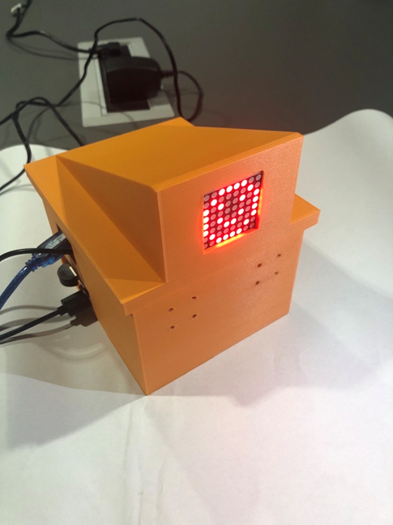
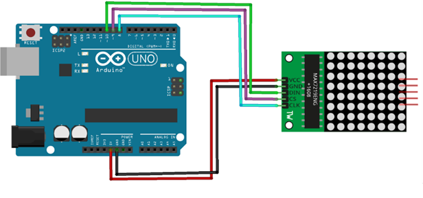
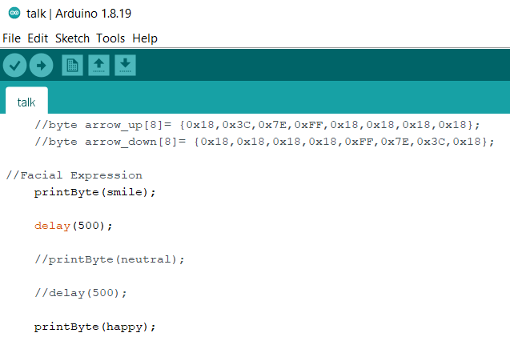
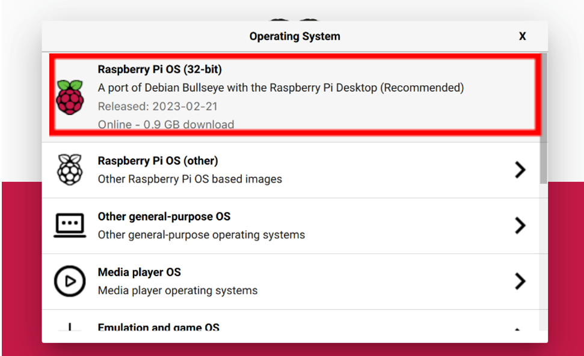
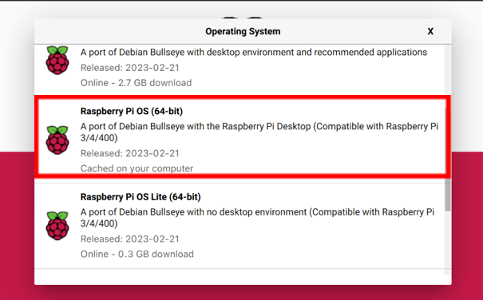
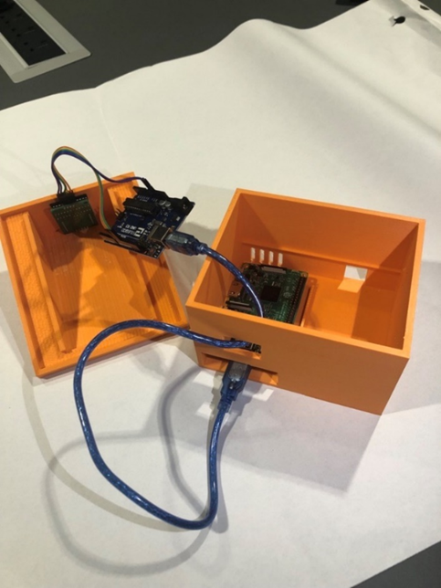
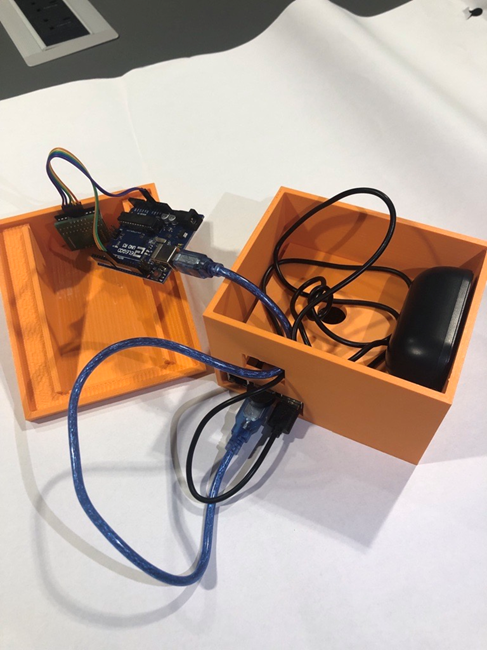
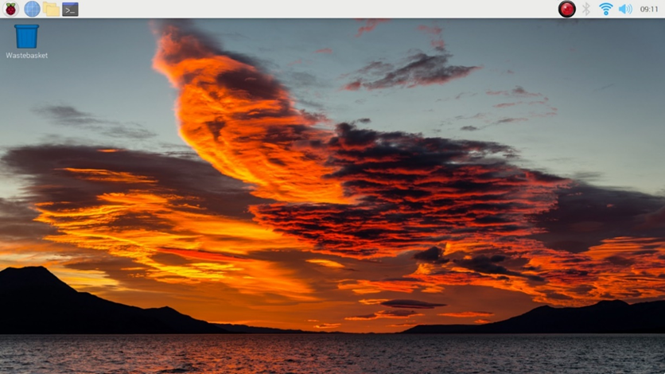
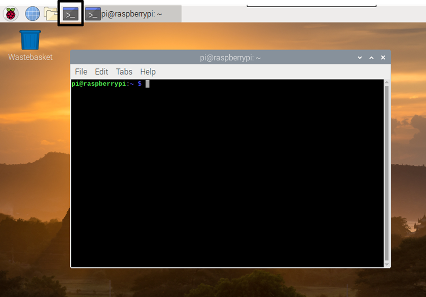

## Name
LTP Smart Speaker

## Description
Let people know what your project can do specifically. Provide context and add a link to any reference visitors might be unfamiliar with. A list of Features or a Background subsection can also be added here. If there are alternatives to your project, this is a good place to list differentiating factors.

## Visuals

## Installation
Disclaimer: these instructions are for windows

### Equipment links
micro SD https://www.amazon.co.uk/Kingston-microSDHC-SDC4-8GB-Adapter-black/dp/B001CQT0X4/ref=asc_df_B001CQT0X4/?tag=googshopuk-21&linkCode=df0&hvadid=309924738384&hvpos=&hvnetw=g&hvrand=2099474083048761382&hvpone=&hvptwo=&hvqmt=&hvdev=c&hvdvcmdl=&hvlocint=&hvlocphy=9045370&hvtargid=pla-381844061666&psc=1

Raspberry Pi 4 https://thepihut.com/products/raspberry-pi-4-model-b?variant=20064052740158&src=raspberrypi

USB microphone https://www.amazon.co.uk/Recording-Microphone-Omnidirectional-Portable-Conferencing-BLACK/dp/B088D6SJBQ/ref=sr_1_9?crid=GQHIZTYCCSO&keywords=raspberry+pi+microphone&qid=1682044087&sprefix=raspberry+pi+microphone%2Caps%2C85&sr=8-9

USB Speaker https://www.amazon.co.uk/Speaker-Portable-Loudspeaker-Multimedia-Notebook/dp/B006RBSHAQ/ref=sr_1_20?crid=1ZSMF3JOD61X0&keywords=usb+speaker&qid=1682044405&sprefix=usb+speaker%2Caps%2C87&sr=8-20

Arduino Uno kit https://www.amazon.co.uk/Project-Starter-Tutorial-Prototype-Expansion/dp/B01D8KOZF4/ref=sr_1_2_sspa?keywords=arduino+uno+kit&qid=1682043917&sr=8-2-spons&sp_csd=d2lkZ2V0TmFtZT1zcF9hdGY&psc=1

Micro HDMI https://www.amazon.co.uk/Twozoh-High-Speed-Braided-support-Raspberry/dp/B08RB1HKKB/ref=sr_1_1_sspa?crid=3VB2K7MX4Y9AF&keywords=micro+hdmi+cable&qid=1682044139&sprefix=micro+hdmi+cable%2Caps%2C72&sr=8-1-spons&sp_csd=d2lkZ2V0TmFtZT1zcF9hdGY&psc=1

Mouse

Keyboard

### Printing the 3D case
Forward the Rasp_Pi_Case.stl file to 3D technician for printing https://drive.google.com/file/d/1Woy9y_80DmZeytRBNK62dr2omwc7E8f3/view?usp=sharing

### Setting up the arduino
Connect the arduino to the 8 x 8 LED display using 5 male to female wires as displayed in the diagram below

Place 8 x 8 LED display into the 3D printed case

Connect the arduino board to laptop using the arduino USB charing cable.
Open the talk.ino file in the Arduino desk app.

First press the tick icon in the top left to verify the file. When verification is finished then press the right arrow icon to upload the animation.

 
### Getting the raspberry pi imager on the SD card 
Software needed: 
Raspberry pi imager https://downloads.raspberrypi.org/imager/imager_latest.exe 
 
Install the raspberry pi imager software using the link above or the by following this page https://www.raspberrypi.com/software/ 

Insert the microSD card into the adapter then into the laptop. 

After opening the imager software, press the button that states “Choose OS”.  

Select the first option as seen below

 
After pressing it scroll down and select the 64-bit raspberry pi os as shown below 

 

Next select the storage by pressing the button in the middle and selecting the respective SD card, after that just press write and wait for it to complete.

After completion insert SD card into the Raspberry Pi.

Plug the Arduino USB power cable into one of the raspberry pi USB ports. 

Plug the microphone and speaker into Raspberry Pi USB Ports

Connect Raspberry Pi to power and close the case.

 

### First time setup
For first time use, plug the Raspberry Pi into a monitor for setup using HDMI cable.
Wait for the Raspberry Pi to successfully boot up on the monitor.

Press the Raspberry Pi logo at the top left of the screen
Navigate to Preferences>Raspberry Pi Configuration>Hostname
Make sure that the Hostname is set as “raspberrypi”

 
### Running Mycroft on the Raspberry Pi
Open the Raspberry Pi command prompt 

Type in commands:

`git clone https://github.com/MycroftAI/mycroft-core.git`

`cd mycroft-core`

(For the first time only) `./dev_setup.sh`

You will be prompted with yes or no questions answer as follows:

`N`
`N`
`N`
`Y`
`Y`

./dev_setup.sh takes a long time to run so feel free to grab some coffee

Type in command:

`./start-mycroft.sh cli` (disclaimer: if this command does not work, run `./dev_setup.sh` again)

(If any other problems arise run this command:`./start-mycroft.sh all restart`, then: `./start-mycroft.sh cli`)

 
### Installing skills
To install skills use the following commands in the Mycroft command prompt:

‘install https://github.com/adamkalbouneh/compliment-me-skill’

‘install https://github.com/adamkalbouneh/joke-skill’

‘install https://github.com/adamkalbouneh/happy-skill’

‘install https://github.com/adamkalbouneh/bored-skill’

‘install https://github.com/adamkalbouneh/i-love-you-skill’

‘install https://github.com/adamkalbouneh/sad-skill’

‘install https://github.com/adamkalbouneh/myname-skill’

‘install https://github.com/adamkalbouneh/breathing-exercise-skill’

‘install https://github.com/adamkalbouneh/affirmations-skill’

‘install https://github.com/adamkalbouneh/good-morning-skill’

‘install https://github.com/adamkalbouneh/sad-skill’

‘install https://github.com/adamkalbouneh/happy-skill’

‘install https://github.com/adamkalbouneh/good-night-skill’

‘install https://github.com/johnbartkiw/mycroft-skill-tunein’

‘install https://github.com/adamkalbouneh/lonely-skill-skill’

‘install https://github.com/ethanallenharris/unprompted-dialog-skill.git’

‘install https://github.com/ethanallenharris/routine-new-skill’

###Installing ChatGPT skill 

How to get started with the ChatGPT skill. 

Open the terminal and write the following command: 

 cd mycroft-core 

Then to install openai by writing pip install openai   

 Once complete, enter the skills directory with the following command cd skills 

 Clone the repository by writing  
git clone https://github.com/marwiieee/mycroft-chatgpt-fallback.git 

Then, open the cloned repository in Geany 
(which can be found by clicking the raspberry pi icon → programming → Geany) and open the settings.json file   

 Where it says “key: “ input your chatgpt api key after the semi colon but within the quotations. 
 

### Installing mycroft-spotify skill

Firstly we must install the Mycroft spotify skill. When we are in the Mycroft interface we ask Mycroft to 
`install beta spotify`

respond “yes” when Mycroft begins recording. After responding Mycroft will begin to install the spotify by forslund skill onto the Raspberry Pi.

The user will need to register a Spotify developer account.
https://developer.spotify.com/dashboard/login

Before being able to use this newly installed skill, we need to provide the credentials to use spotify’s API. For this we will need to create an “Application” on the Spotify developer dashboard, found at: https://developer.spotify.com/dashboard/applications 

After creating a spotify “Application” the user should be provided a “Client ID” and “Service ID”

Then run the commands:

`source venv-activate.sh`

`python skills/mycroft-spotify.forslund/auth.py`

After we have started the API authentication python program, it will ask the user to enter their spotify “Application” “client ID” and “secret ID” provided earlier.

After completing the authorisation process spotify will now be utilisable by the Mycroft program and the user can now request spotify music to be played on a “listening device”. Unfortunately due to spotify no longer supporting the Mycroft spotify API (add reference) the Mycroft AI is no longer registered as a listening device/interface, thus not being able to play music. 

This means we will need to give the Raspberry Pi the ability to register as a spotify listening device. For this we are going to utilise the “raspotify” repository to connect to spotify services and register the Raspberry Pi as a listening device.

https://github.com/dtcooper/raspotify

### Installing and setting up raspotify
Disclaimer: editing files with the nano text editor might require changing the terminals directory to “/etc/”

Install the raspotify repository via the command:

`sudo apt-get -y install curl && curl -sL https://dtcooper.github.io/raspotify/install.sh | sh`

After installing the raspotify repo we need to configure the audio output. Run the command: 

`sudo apt update && sudo apt install -y asound-conf-wizard`

List audio cards

`aplay -l`

Run the command below and replace “{card number}” with the desired audio card.

`aplay -Dhw:{card number} --dump-hw-params /usr/share/sounds/alsa/Front_Right.wav`

(audio card selected should be headphone or audio jack)

Afterwards, we need to edit the “/etc/asound.conf” configuration file which may or may not already exist.

To do this we need to run the command:
`sudo nano /etc/asound.conf`

Insert the text below and replace the {card number} with the previously entered card slot

`defaults.ctl.card {card number}`
`defaults.pcm.card {card number}`
`defaults.pcm.dmix.rate 44100`
`defaults.pcm.dmix.format S32_LE`
And save the file before exiting the nano text editor.

Next we need to edit the librespot config.
`sudo nano /etc/raspotify/conf`

And add your premium spotify accounts credentials to replace the `Spotify Username` and `Spotify Password`.
`LIBRESPOT_USERNAME="{Spotify Username}"`
`LIBRESPOT_PASSWORD="{Spotify Password}"`

However if you have disabled discovery for whatever reason and you provided your credentials you will also want to enable credential caching so that librespot will cache the auth token and not have to login every time you connect.

To do this change:

`# Disable caching of credentials.`
`# Caching of credentials is not necessary so long as`
`# LIBRESPOT_DISABLE_DISCOVERY is not set.`
`LIBRESPOT_DISABLE_CREDENTIAL_CACHE=`

to

`# Disable caching of credentials.`
`# Caching of credentials is not necessary so long as`
`# LIBRESPOT_DISABLE_DISCOVERY is not set.`
`#LIBRESPOT_DISABLE_CREDENTIAL_CACHE=`

To make sure all changes take effect you must restart the Raspotify service:

`sudo systemctl restart raspotify`

To check raspotify has been configured correctly we can run the command:

`sudo systemctl status raspotify`

Afterwards you might need to reset mycoft-core to apply the changes:

`bash start-mycroft.sh restart all`

And start mycroft again:

`bash start-mycroft.sh debug`

## Support
vujovicm@cardiff.ac.uk

shahina@cardiff.ac.uk

omarfm@cardiff.ac.uk

kalbouneha@cardiff.ac.uk

allen-harrise@cardiff.ac.uk

## Authors and acknowledgment
Milos Vujovic

Ahmad Shahin

Fatima Marwa Omar

Adam Kalbouneh

Ethan Allen-Harris

## Project status
Completed on 21/04/2023
